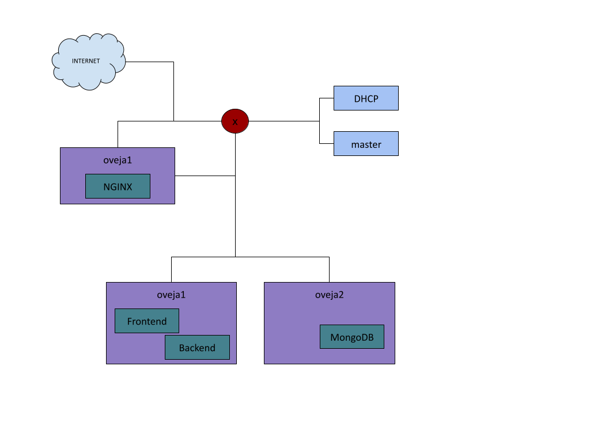
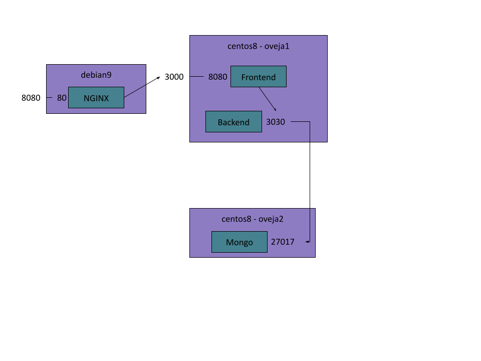

# Administración de Infraestructuras TIC y Sistemas
### Curso 2021/2022


## Ansible playbooks

[Playbooks + Instrucciones](playbooks)


## Balanceador de carga: NGINX

Utilización de imagen de nginx: [Imagen oficial](https://hub.docker.com/_/nginx)

```
docker pull nginx
```

NGINX configuration file: [nginx.conf](nginx.conf)

Uso:

```
docker run --name lb -v /home/ansible/nginx-conf/nginx.conf:/etc/nginx/nginx.conf -d -p 8080:80 nginx
```

## App frontend

App Conduit: [Web Components Realworld Example App](https://github.com/gothinkster/web-components-realworld-example-app)

Abrir puertos: ```sudo firewall-cmd --add-port=3000/tcp```

Imagen: [alu0101106335/realworld-frontend](https://hub.docker.com/repository/docker/alu0101106335/realworld-frontend)

Dockerfile:

```dockerfile
FROM node:15.13.0-alpine

RUN apk --no-cache add git
COPY package.json .
RUN npm install

COPY . .

STOPSIGNAL SIGINT
EXPOSE 8080

CMD ["npm", "run", "start"]
```

Uso: 

```
docker run --rm --name client -p 3000:8080 -it alu0101106335/realworld-frontend
```


## App backend

App Conduit: [Feathers Realworld Example App](https://github.com/randyscotsmithey/feathers-realworld-example-app)

Imagen: [alu0101106335/realworld-backend](https://hub.docker.com/repository/docker/alu0101106335/realworld-backend)

Dockerfile:

```dockerfile
FROM node:15.13.0-alpine

COPY package.json .
WORKDIR /app

COPY . .

STOPSIGNAL SIGINT
RUN npm install

EXPOSE 3030

CMD ["npm", "start"]
```

Uso: 

```
docker run --name server -e MONGODB_FEATHERS_REALWORLD="mongodb://192.168.0.123:27017" -p 3030:3030 -it alu0101106335/realworld-backend
```


## Base de datos: MongoDB

Utilización de imagen de MongoDB: [Imagen oficial](https://hub.docker.com/_/mongo)

```
docker pull mongo
```

Uso:

```
docker run --name bbdd -v /home/ansible/mongo:/data/db -d -p 27017:27017 mongo
```

## Comandos útiles

```
# Ver contenedores en ejecución
docker container ps

# Ver todos los contenedores
docker container ps -a

# Ver imágenes instaladas
docker image ls

# Parar contenedores
docker container stop [nombre_contenedor]

# Eliminar contenedores parados
docker container prune
```


## Infraestructura




